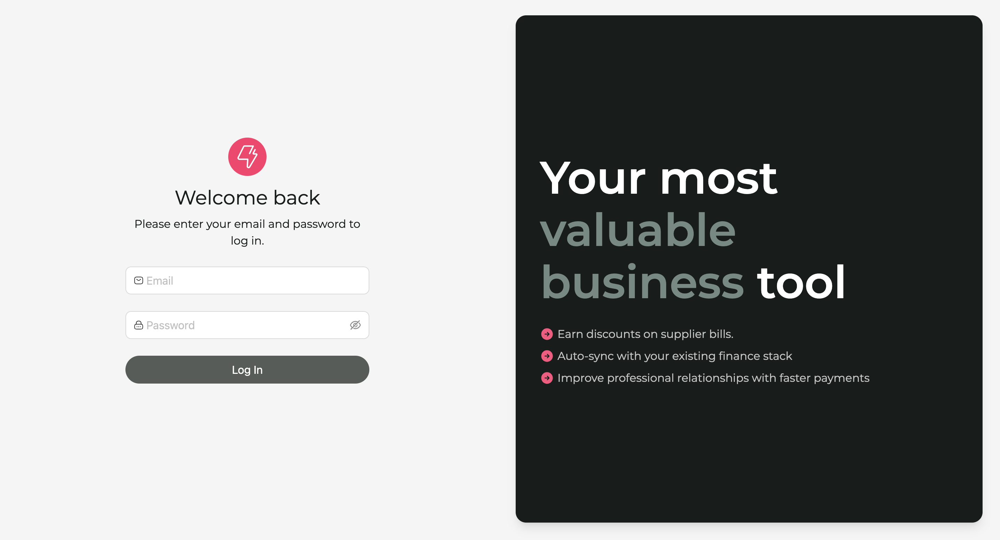
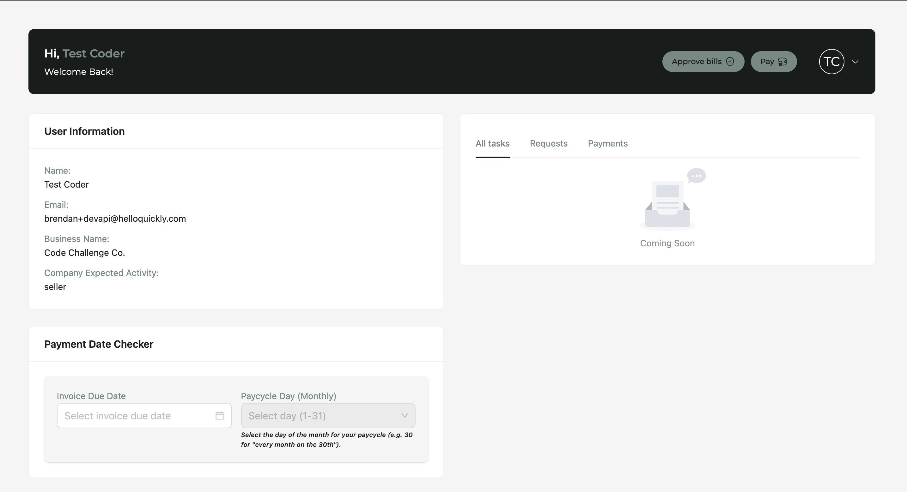
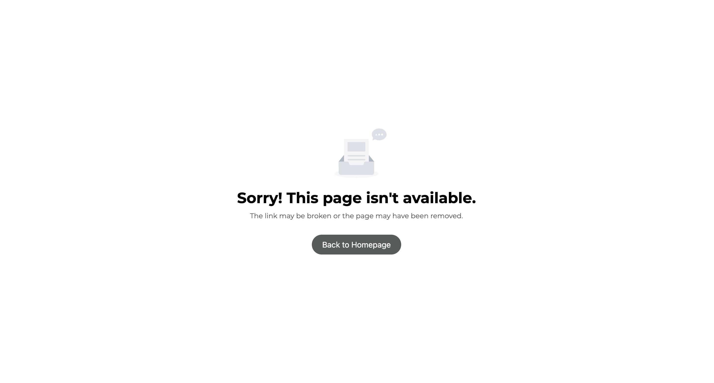
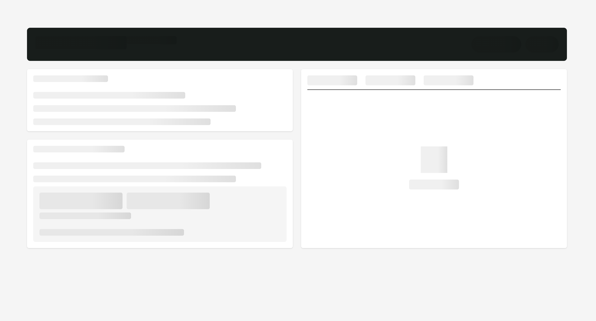

# Quickly Test

A modern React application built with **TypeScript**, **Vite**, **Tailwind CSS**, **Ant Design**, and **Iconsax**.

## Features

- **Login Page** with validation and API integration

- **Profile Page** displaying user information

- **Payment Date Checker** component for invoice and pay cycle calculations
- **404 Page** that gracefully informs users when a requested page is not found

- Responsive and accessible UI
- **Skeleton Loaders** for improved user experience during data fetching, providing visual feedback while content is loading



## Technologies Used

- [**TypeScript**](https://www.typescriptlang.org/) – Strongly typed JavaScript
- [**React**](https://react.dev/) (bootstrapped with [**Vite**](https://vitejs.dev/)) – Fast, modern frontend framework
- [**Tailwind CSS**](https://tailwindcss.com/) – Utility-first CSS framework for rapid UI development
- [**Ant Design**](https://ant.design/) – Enterprise-class UI components
- [**Iconsax**](https://iconsax.io/) – Beautiful, customizable icon set
- [**React Query**](https://tanstack.com/query/latest) – Powerful data fetching and caching for React
- [**Axios**](https://axios-http.com/) – Promise-based HTTP client for API requests
- [**Zustand**](https://zustand-demo.pmnd.rs/) – Lightweight state management for React

## Getting Started

1. **Clone the repository**
   ```bash
   git clone <repository-url>
   cd test
   ```

2. **Create a `.env` file**
   - Copy the `.env.template` file in the root folder and rename it to `.env`.
   - Update the environment variables in `.env` as needed.

3. **Install dependencies**
   ```bash
   npm install
   ```

4. **Run the development server**
   ```bash
   npm run dev
   ```
  
